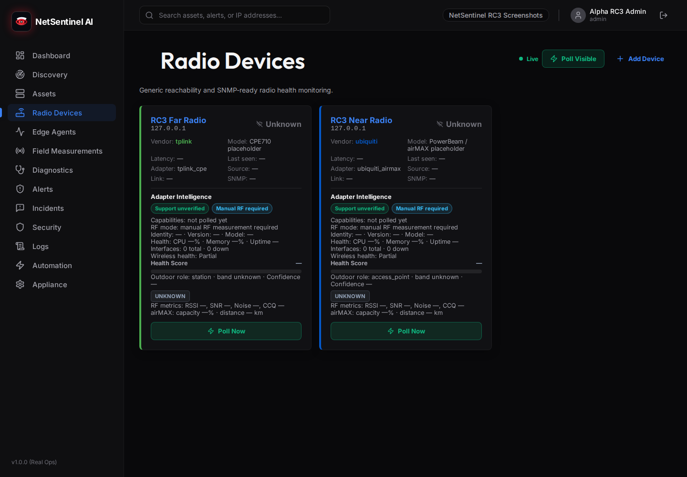
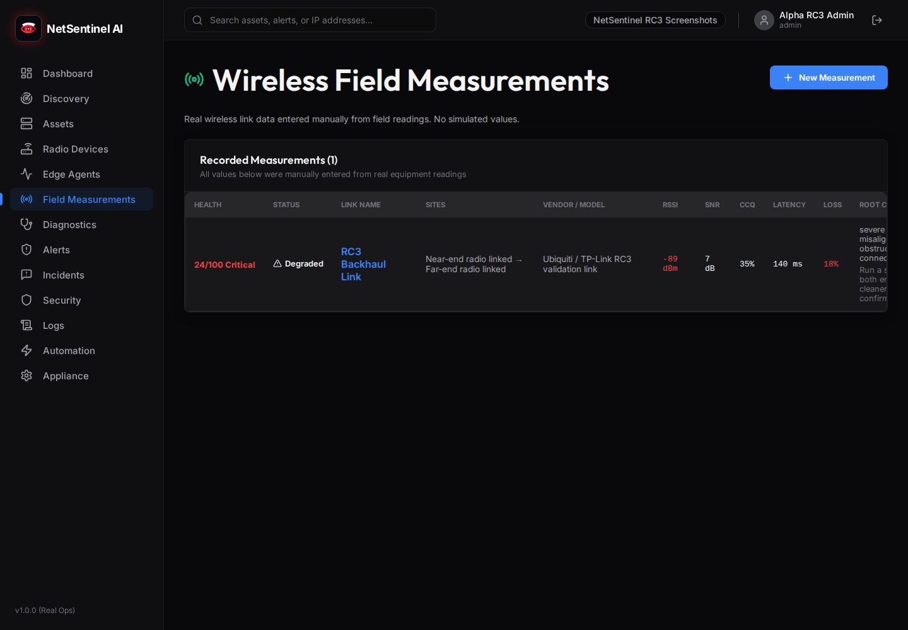
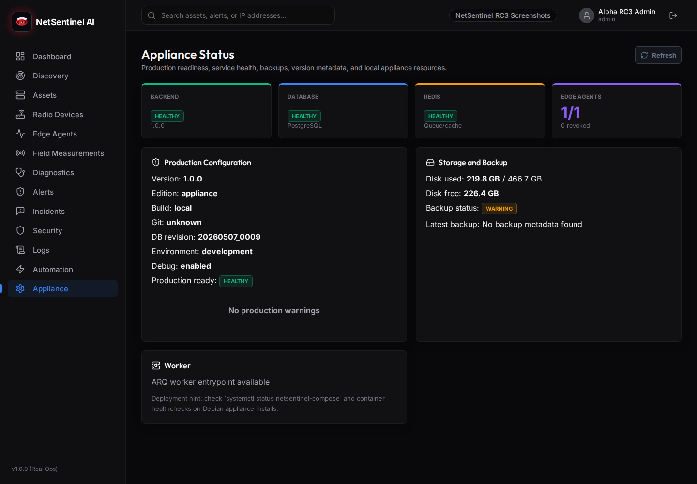
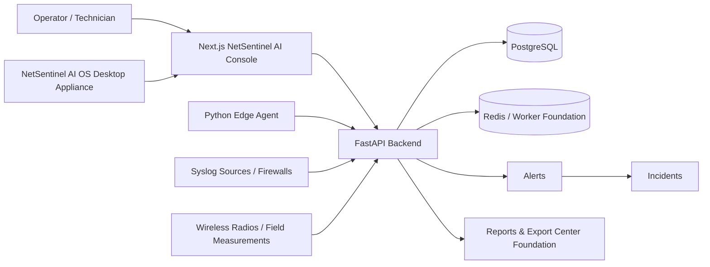

# NetSentinel AI

**NetSentinel AI OS / Platform**  
**Network Operations • Cybersecurity • Wireless Diagnostics • Hybrid Cloud**


NetSentinel AI is a professional network operations, cybersecurity monitoring,
outdoor wireless diagnostics, and hybrid cloud observability platform designed
to evolve into a dedicated desktop appliance OS.

The project combines a local-first NetSentinel AI Console, a FastAPI backend,
PostgreSQL, Redis/worker foundations, Edge Agent telemetry, syslog ingestion,
wireless field measurements, vendor adapter foundations, and a staged XFCE
Desktop Appliance Experience for future ISO validation.

> **Status: Public Alpha / Active Development**
>
> NetSentinel AI is **not production-ready**. Use it for local labs,
> engineering evaluation, documentation review, appliance prototyping, and
> contributor feedback.
>
> The Desktop Appliance / ISO path is under validation. Cloud and AI connectors
> are foundation/roadmap unless explicitly documented as implemented. No default
> production credentials are provided.

## Screenshots

These screenshots are real captures from a local NetSentinel AI app instance.
They are not generated mockups. New screenshots must be captured from the
running app or OS and reviewed before being linked here.

| Login | First-Run Setup |
| --- | --- |
|  |  |

| Control Center Dashboard | Assets / Network Inventory |
| --- | --- |
|  |  |

| Alerts | Incidents |
| --- | --- |
|  |  |

| Logs / Security Events | Wireless Link Detail |
| --- | --- |
|  |  |

| Radio Devices | Field Measurements |
| --- | --- |
|  |  |

| Agents | Appliance Status |
| --- | --- |
|  |  |

Pending real screenshots:

- Network Operations v3 workspace
- Wireless Diagnostics v3 workspace
- Security Operations v3 workspace
- AI Copilot foundation workspace
- Cloud & Hybrid foundation workspace
- Reports & Export Center
- XFCE Desktop Appliance
- NetSentinel AI OS boot menu

## What NetSentinel AI Provides

### Control Center

- Real dashboard APIs for assets, alerts, incidents, agents, wireless health,
  recent activity, topology summary, and appliance/system status.
- Operator-first loading, empty, and error states.
- Roadmap-safe Cloud & Hybrid and AI Copilot panels without fake production data.

### Network Operations

- Asset inventory, discovery, polling, topology summary, reachability signals,
  and network alert context.
- ICMP and SNMP foundations where supported by current adapters.
- No fake topology graph; summary views are based on available inventory data.

### Wireless Diagnostics

- Radio devices, wireless links, field measurements, and RF health visibility.
- RSSI, SNR, noise floor, CCQ, latency, packet loss, TX/RX capacity, and missing
  RF fields when data is unavailable.
- Rule-based health scoring, deterministic root-cause hints, recommended
  technician actions, source confidence labels, and Poor/Critical alert creation.
- MikroTik, TP-Link, and Ubiquiti adapter foundations with real capture
  validation still required.

### Security Operations

- Authenticated syslog ingestion foundation.
- Fortinet/FortiGate-style syslog parsing and normalized security fields.
- Alerts, incidents, evidence drawer patterns, lifecycle status, and safe
  investigation workflow.
- No full SIEM, EDR, XDR, SOAR, auto-blocking, or destructive response claims.

### AI Copilot

- Privacy-first troubleshooting workspace foundation.
- No external AI provider calls by default.
- No provider keys or cloud credentials in the repository.
- Local deterministic summaries where available; Claude, OpenAI, local models,
  and enterprise endpoints remain future provider options behind redaction and
  operator approval.

### Cloud & Hybrid

- Professional foundation workspace for AWS, Azure, Google Cloud, Cloudflare,
  VPN tunnel health, public exposure, cloud logs, and hybrid topology planning.
- No cloud credentials configured by default.
- No external cloud API calls are made by the current foundation page.

### Reports & Export Center

- Report foundation for network, wireless, security, incident, cloud/hybrid
  future, and appliance health reporting.
- Backup/restore status posture and safe sharing/redaction policy.
- PDF/HTML/CSV/JSON export generation remains future backend work unless a
  specific export is explicitly implemented.

### Desktop Appliance OS

- XFCE + LightDM + NetworkManager Desktop Appliance profile.
- NetSentinel desktop shortcuts for Console, Control Center, Appliance Status,
  Network Tools, Packet Tools, Wireless, Security, Cloud, Reports, and Docs.
- No kiosk default and no automatic browser launch after boot.
- Network/security/wireless/cloud diagnostic toolset and hardware driver support
  strategy.
- Live-image scaffold is ready for future Desktop ISO rebuild and VMware visual
  validation; no production ISO is claimed here.

## Architecture



Project structure:

| Path | Role |
| --- | --- |
| `frontend/` | Next.js 14 TypeScript NetSentinel AI Console |
| `backend/` | FastAPI API, SQLAlchemy models, Alembic migrations, services |
| `edge-agent/` | Python Edge Agent foundation |
| `desktop-client/` | Electron local launcher shell |
| `deploy/` | Appliance scripts, desktop launchers, live-image scaffold |
| `scripts/` | Backup, restore, backend validation, migration validation |
| `docs/` | Product, OS, security, wireless, cloud, release, and GitHub docs |

Runtime components:

- Frontend: Next.js 14 + TypeScript
- Backend: FastAPI + Python
- Database: PostgreSQL
- Cache/worker foundation: Redis / ARQ
- Agents: Python Edge Agent foundation
- Runtime: Docker Compose for local deployment
- OS direction: NetSentinel AI OS Desktop Appliance scaffold

## Quick Start: Local Docker Compose Lab

Prerequisites:

- Docker with Compose v2
- Git

```bash
git clone https://github.com/Aboulouafae-it/NetSentinel-AI.git "NetSentinel AI"
cd "NetSentinel AI"
cp .env.example .env
docker compose up --build -d
docker compose exec backend alembic upgrade head
```

Open the first-run setup:

```text
http://localhost:3000/setup
```

Create the first organization and admin user. Use local lab values only. Do not
reuse demo secrets, weak JWT secrets, or local test credentials outside a trusted
development environment.

Useful local URLs:

| Service | URL |
| --- | --- |
| NetSentinel AI Console | `http://localhost:3000` |
| First-run setup | `http://localhost:3000/setup` |
| Backend API | `http://localhost:8000` |
| Swagger docs | `http://localhost:8000/docs` |
| ReDoc | `http://localhost:8000/redoc` |

## Validation Commands

```bash
bash scripts/validate_backend.sh
cd frontend && npx tsc --noEmit --pretty false
npm --prefix frontend run build
deploy/live-image/build-live-prototype.sh --check-only
```

`scripts/validate_backend.sh` creates or reuses `.tmp/backend-venv`, installs
backend requirements, imports `app.main`, and runs `pytest backend/tests -q`.

## Desktop / OS Preview

NetSentinel AI OS is planned as a dedicated desktop appliance experience.

Current state:

- live-image scaffold exists,
- XFCE Desktop Appliance profile is staged,
- desktop shortcuts are staged,
- backend validation and desktop ISO preflight docs exist,
- future Desktop ISO rebuild and VMware/QEMU validation remain the next packaging
  phase.

Important behavior:

- the browser does not auto-open on boot,
- kiosk mode is not the default,
- the operator opens NetSentinel AI Console from the desktop shortcut,
- terminal fallback remains available through `netsentinel-menu` and
  `appliance-status`.

See:

- [Desktop Appliance Experience](docs/DESKTOP_APPLIANCE_EXPERIENCE.md)
- [Live Appliance Image](docs/LIVE_APPLIANCE_IMAGE.md)
- [Desktop ISO Preflight Checklist](docs/DESKTOP_ISO_PREFLIGHT_CHECKLIST.md)
- [Desktop ISO VM Test Plan](docs/DESKTOP_ISO_VM_TEST_PLAN.md)
- [Hardware Driver Support](docs/HARDWARE_DRIVER_SUPPORT.md)

## Roadmap

| Stage | Focus |
| --- | --- |
| v3.x Product Experience | Control Center, Network Operations, Wireless Diagnostics, Security Operations, AI Copilot foundation, Cloud & Hybrid foundation, Reports & Export Center, Desktop Appliance preparation. |
| v4.x Desktop ISO / Appliance Validation | Build Desktop ISO, VMware/QEMU validation, screenshots, checksums, persistence/install planning, release artifact discipline. |
| v5.x Real Device Validation | Reviewed MikroTik, TP-Link, Ubiquiti, Fortinet, SNMP, syslog, and wireless capture validation with redacted fixtures. |
| v6.x Cloud / AI / Enterprise | Optional cloud connectors, privacy-controlled AI providers, RBAC hardening, audit trails, report generation, enterprise deployment patterns. |

## Known Limitations

- Not production-ready.
- Cloud connectors are not implemented as live providers.
- AI providers are not active and no external AI calls are made by default.
- Real vendor RF support needs reviewed captures and field validation.
- Reporting/export generation is foundation work and not a complete compliance
  reporting system.
- Persistence/install validation and Desktop ISO visual validation are pending.
- Vendor adapters are partial/foundation work.
- Fortinet support is syslog/profile oriented; no firewall configuration API is
  claimed.
- Credential storage, RBAC, audit logging, and rate limiting require additional
  hardening before production use.
- No formal project license has been selected.

## Documentation

Start with the [documentation portal](docs/README.md).

High-value entry points:

- [V3 Master Execution Plan](docs/NETSENTINEL_V3_MASTER_EXECUTION_PLAN.md)
- [Information Architecture](docs/NETSENTINEL_INFORMATION_ARCHITECTURE.md)
- [UI Design System](docs/NETSENTINEL_UI_DESIGN_SYSTEM.md)
- [Wireless Diagnostics Workflow](docs/WIRELESS_DIAGNOSTICS_WORKFLOW.md)
- [Syslog Profiles](docs/SYSLOG_PROFILES.md)
- [Reports & Export Center](docs/REPORTS_EXPORT_CENTER.md)
- [AI Privacy and Prompt Safety](docs/AI_COPILOT_PRIVACY_AND_PROMPT_SAFETY.md)
- [Cloud & Hybrid Roadmap](docs/CLOUD_HYBRID_ROADMAP.md)
- [GitHub Release Prep Checklist](docs/GITHUB_RELEASE_PREP_CHECKLIST.md)

## Security

NetSentinel AI public alpha is not production-hardened.

- Do not commit `.env`, private keys, tokens, database dumps, raw captures,
  backups, or customer data.
- Do not expose PostgreSQL or Redis publicly.
- Use strong unique secrets for any non-local deployment.
- Redact device captures and logs before sharing.
- Treat agent tokens, credential profiles, backups, and syslog data as sensitive.
- Report vulnerabilities privately.

See:

- [SECURITY.md](SECURITY.md)
- [Deployment Hardening](docs/DEPLOYMENT_HARDENING.md)
- [Asset Licensing Policy](docs/ASSET_LICENSING_POLICY.md)
- [AI Privacy and Prompt Safety](docs/AI_COPILOT_PRIVACY_AND_PROMPT_SAFETY.md)

## Contributing

Contributions should preserve the project’s local-first, safety-first posture.

- Keep feature claims honest.
- Add or update tests for backend behavior.
- Run frontend build/type checks for UI changes.
- Never commit secrets, dumps, raw captures, or customer data.
- Keep destructive network/security actions out of the product unless explicitly
  designed, reviewed, and approved.

See [CONTRIBUTING.md](CONTRIBUTING.md).

## OS Base Attribution

NetSentinel AI OS is an independent Debian-based system. Debian is a trademark
of Software in the Public Interest, Inc. NetSentinel AI is not produced by,
endorsed by, or affiliated with the Debian Project. Debian is used as a
technical base, not as the NetSentinel product identity.

## License

License not yet selected. All rights reserved until a license is added.

Before public production use, distribution, packaging, or broad external
contribution, a formal license decision is required.
