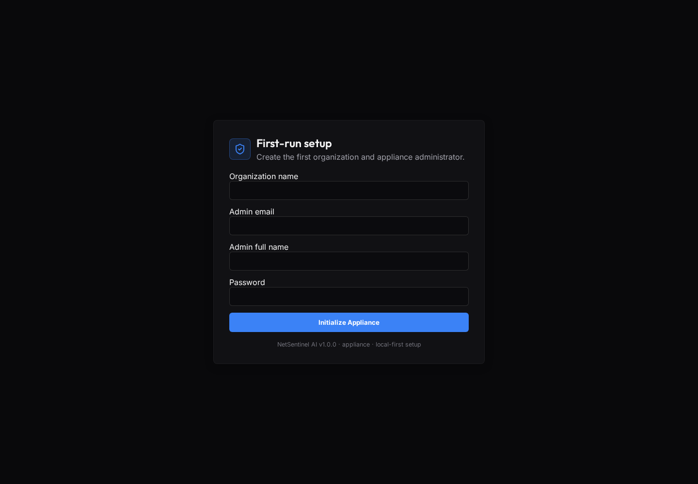
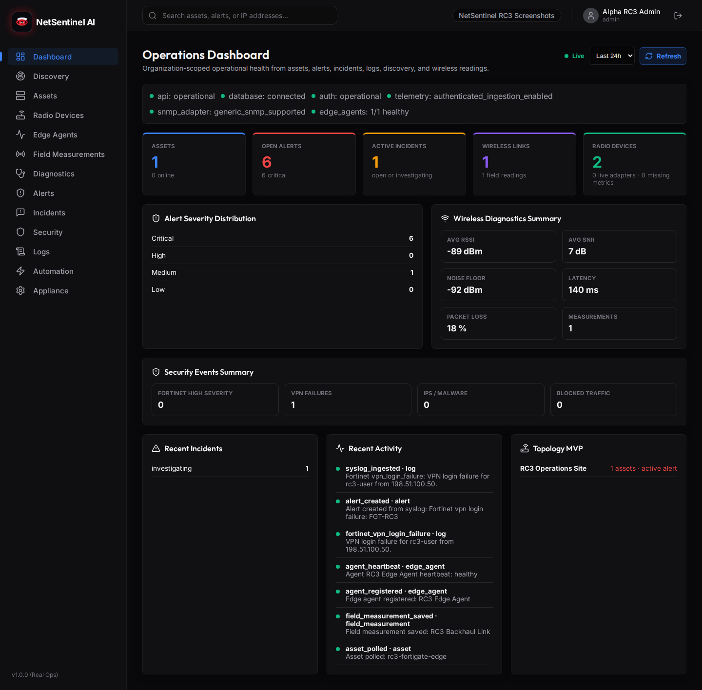
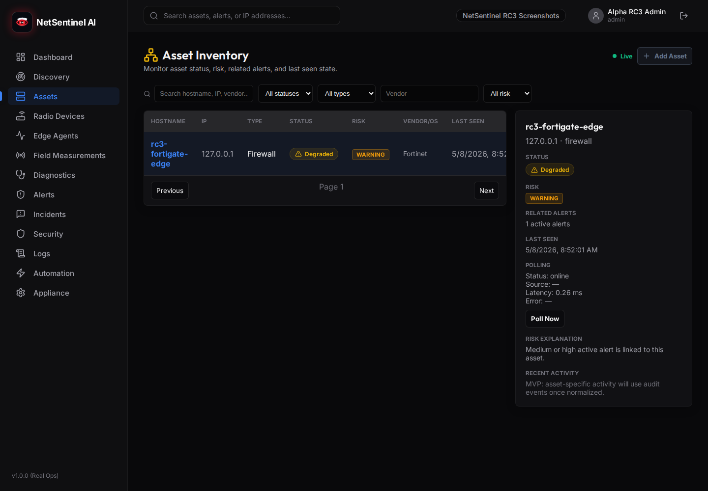
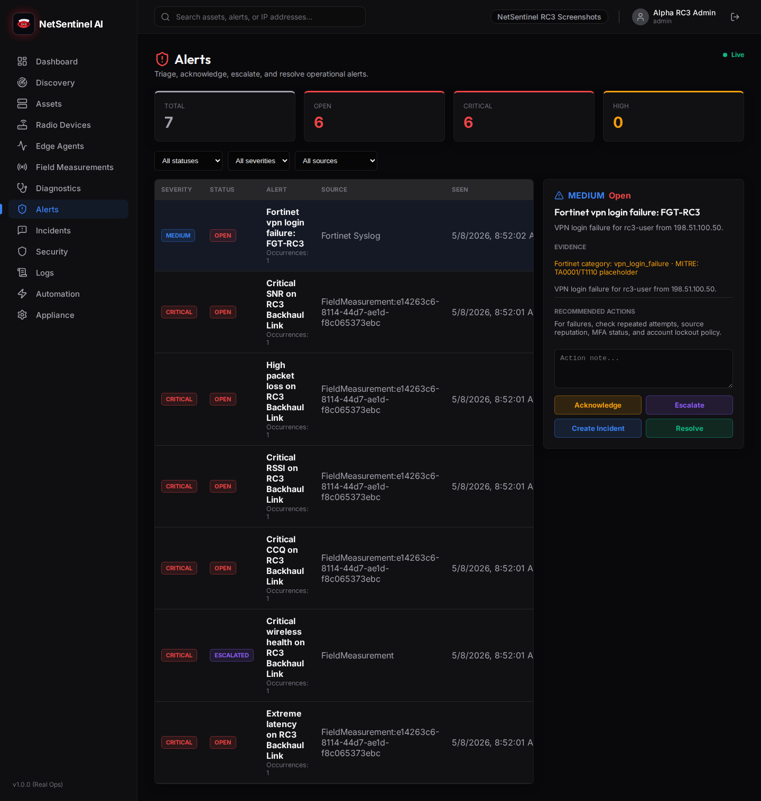
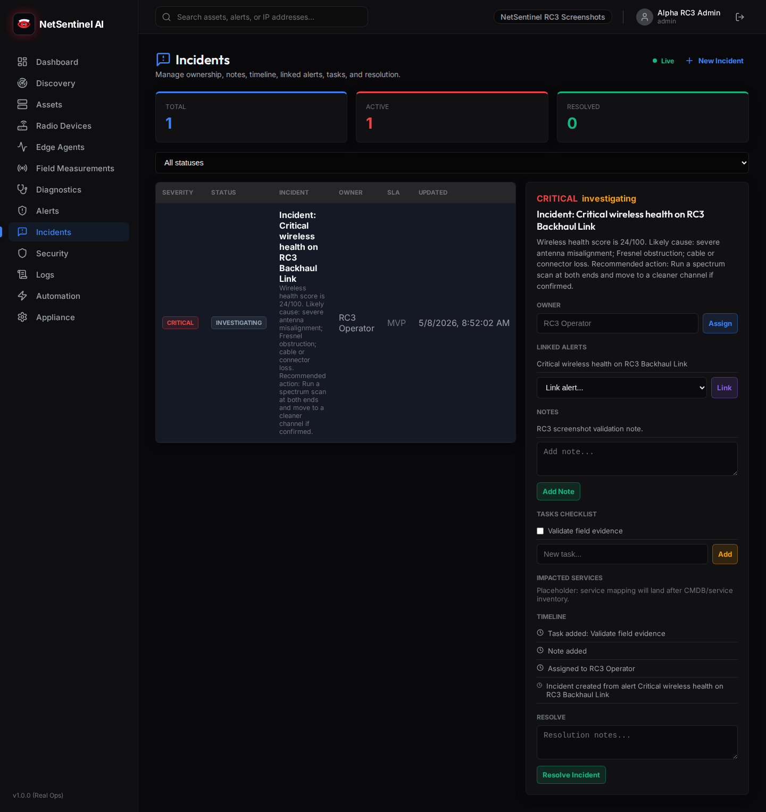
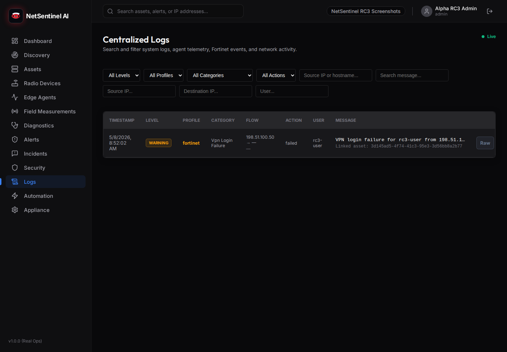
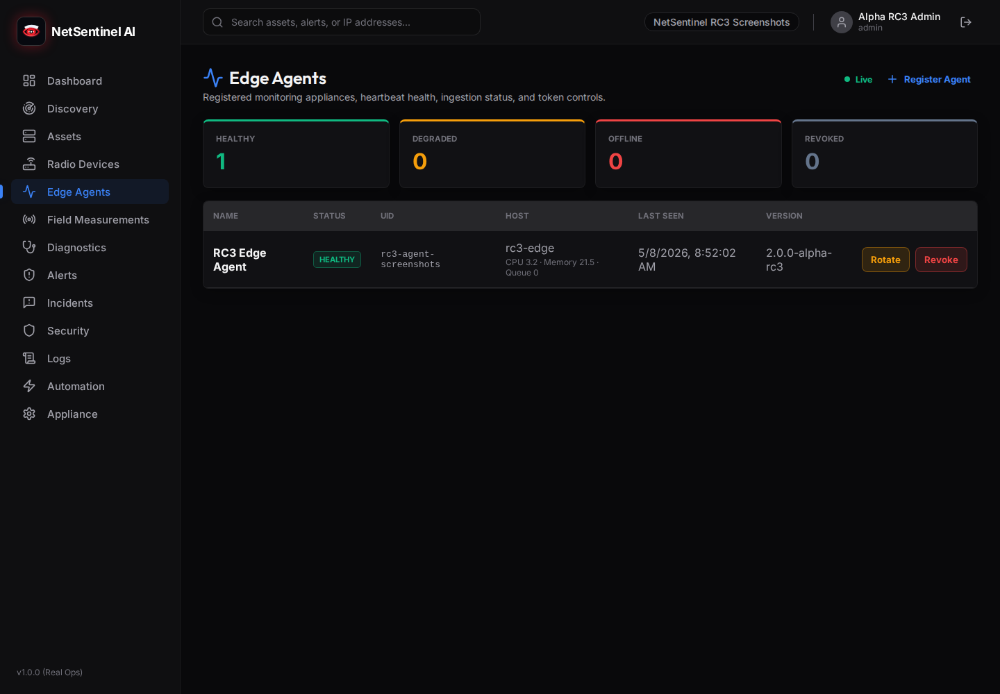
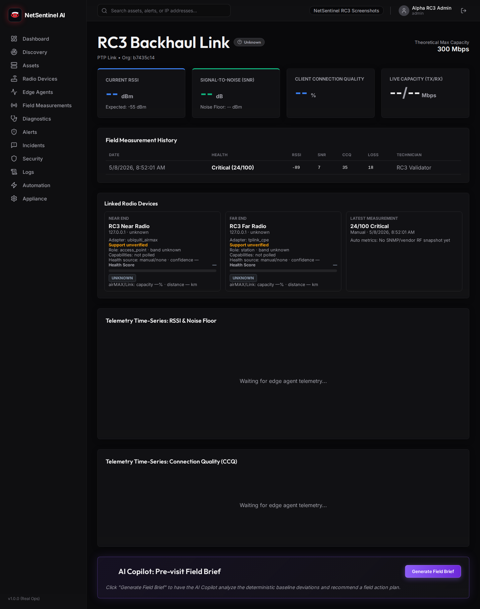

# NetSentinel AI

**Local-First Network Observability, Cybersecurity & Outdoor Wireless Diagnostics Platform**

NetSentinel AI is a public-alpha appliance-style platform for local NOC/SOC
operations, network observability, security event monitoring, and outdoor
wireless diagnostics.

It brings assets, alerts, incidents, logs, Edge Agents, syslog, ICMP/SNMP
polling, wireless field measurements, Fortinet security events, and early
vendor adapter intelligence into one local operator console.

> **Status:** Public Alpha / MVP / Work in Progress.
>
> NetSentinel AI is **not production-ready**. Use it for evaluation,
> development, local lab testing, appliance prototyping, and contributor
> feedback.

## Screenshots

These screenshots were captured from a real local v2.0.0-alpha RC3 app
instance. They are not generated mockups or marketing images.

| Login | Dashboard |
| --- | --- |
|  |  |

| Assets | Alerts |
| --- | --- |
|  |  |

| Incidents | Logs / Fortinet |
| --- | --- |
|  |  |

| Agents | Wireless Link Detail |
| --- | --- |
|  |  |

More captures:
[setup](docs/assets/screenshots/setup.png),
[radio devices](docs/assets/screenshots/radio-devices.png),
[field measurements](docs/assets/screenshots/field-measurements.png), and
[appliance status](docs/assets/screenshots/appliance-status.png).

## Core Capabilities

### Operations Dashboard

- Real organization-scoped dashboard APIs.
- KPI cards for assets, alerts, incidents, agents, wireless links, and security
  activity.
- Recent activity, logs preview, topology summary, wireless health, and appliance
  status visibility.

### Asset Inventory

- Asset list, filters, status/risk badges, last seen tracking, and polling
  freshness.
- ICMP reachability foundation and SNMP polling integration.

### Alerts & Incidents

- Alert lifecycle: open, acknowledged, escalated, resolved.
- Incident workflow with owner assignment, notes, timeline events, tasks, linked
  alerts, and resolution.

### Logs & Syslog

- Authenticated HTTP syslog ingestion.
- Log storage, asset linking where possible, activity events, and security event
  classification.

### Fortinet Security Profile

- FortiGate-style key/value syslog parsing.
- Normalized fields for source/destination, action, service, user, VDOM,
  severity, and category.
- Deduped high-value alert candidates for events such as VPN/admin failures,
  IPS/malware hits, HA failover, interface down, and suspicious patterns.

### Edge Agents

- Edge Agent registration, heartbeat, token rotation, telemetry ingestion, and
  appliance status visibility.
- Telemetry-to-asset update foundation.

### Wireless Field Measurements

- Wireless link field measurement capture.
- Deterministic wireless health scoring and diagnosis.
- Poor/Critical measurement alert creation with deduplication.

### Radio Devices

- Radio device polling, last seen tracking, adapter metadata, and manual RF
  fallback.
- Wireless link relationships between near/far radios.

### Vendor Adapters

- Generic SNMP foundation.
- MikroTik RouterOS adapter foundation.
- TP-Link CPE / outdoor radio adapter foundation.
- Ubiquiti airMAX / UISP adapter foundation.
- Fixture lab and real-device capture redaction workflow.

### Appliance Readiness

- First-run setup, production configuration checks, backup/restore scripts,
  installer/update/uninstall scripts, systemd examples, and production Docker
  Compose.

### Debian Live Prototype

- Debian live appliance scaffold and build validation workflow.
- Not a finished ISO; intended as a reproducible prototype path.

## Architecture

```text
frontend/        Next.js NOC/SOC console
backend/         FastAPI API, SQLAlchemy models, Alembic migrations, services
edge-agent/      Python Edge Agent foundation
desktop-client/  Electron shell for local appliance launcher workflows
deploy/          Installer, systemd, reverse proxy, desktop, live image scaffold
scripts/         Backup, restore, and migration validation helpers
docs/            Appliance, security, adapter, release, and workflow docs
```

Runtime components:

- Frontend: Next.js
- Backend: FastAPI
- Database: PostgreSQL
- Queue/cache: Redis / worker foundation
- Agents: Python Edge Agent foundation
- Deployment: Docker Compose and appliance scripts
- Image direction: Debian live-build scaffold

## Quick Start: Docker Compose Lab

Prerequisites:

- Docker with Compose v2

```bash
git clone https://github.com/Aboulouafae-it/NetSentinel-AI.git "NetSentinel AI"
cd "NetSentinel AI"
cp .env.example .env
docker compose up --build -d
docker compose exec backend alembic upgrade head
```

Open:

```text
http://localhost:3000/setup
```

Then create the first organization and admin user. Use a real-looking local
email such as `admin@netsentinel.local` for demo setup.

Development seed data may exist for local-only workflows. Do not use demo
credentials or default secrets outside a trusted lab.

## Appliance Install Prototype

For Debian/Ubuntu-style appliance testing:

```bash
sudo deploy/install-netsentinel.sh
```

Then open:

```text
http://localhost:3000/setup
```

This installer is a **prototype**. Test it in a VM first and back up any
existing appliance data before update or uninstall workflows.

See:

- [Install Appliance](docs/INSTALL_APPLIANCE.md)
- [Appliance Deployment](docs/APPLIANCE_DEPLOYMENT.md)
- [Deployment Hardening](docs/DEPLOYMENT_HARDENING.md)

## Debian Live Image Prototype

The live image workflow is a scaffold, not a production ISO.

```bash
deploy/live-image/build-live-prototype.sh --check-only
```

A real ISO build requires Debian `live-build` in a suitable Debian VM or build
host.

See:

- [Live Appliance Image](docs/LIVE_APPLIANCE_IMAGE.md)
- [Live Image VM Test Plan](docs/LIVE_IMAGE_VM_TEST_PLAN.md)

## Supported Integrations

| Integration | Status | Notes |
| --- | --- | --- |
| Generic SNMP | Partial / supported foundation | Standard system and interface data; no RF claims |
| MikroTik RouterOS | Partial / adapter foundation | Synthetic fixture coverage; real capture and live transport validation needed |
| TP-Link CPE | Partial / SNMP fallback | Manual RF fallback; RF metrics need real OIDs/API captures |
| Ubiquiti airMAX / UISP | Partial / SNMP fallback | Fixture validation; UISP placeholder; UniFi not supported here |
| Fortinet / FortiGate syslog | Partial / syslog profile | Ingest/parse/classify only; no FortiGate API/configuration changes |
| Cambium | Planned | Not implemented |
| Cloud connectors | Future | AWS/Azure/GCP not implemented |

See [Vendor Adapters](docs/VENDOR_ADAPTERS.md) for the full support matrix.

## Testing Status

Latest RC validation in this working tree:

- Backend tests passed.
- Backend import check passed.
- Frontend TypeScript check passed.
- Frontend production build passed.
- Clean Alembic migration baseline validation passed.
- RC2 demo workflow passed on a clean isolated migrated database.
- Docker Compose startup, backup dry-run, live image check-only, and secret scan
  passed.

Run locally:

```bash
python -m pytest backend/tests
cd backend && python -c "import app.main"
cd frontend && npx tsc --noEmit
cd frontend && npm run build
scripts/validate_clean_migrations.sh
scripts/backup.sh --dry-run
deploy/live-image/build-live-prototype.sh --check-only
```

## Documentation

- [Demo Workflow](docs/DEMO_WORKFLOW.md)
- [Known Limitations](docs/KNOWN_LIMITATIONS.md)
- [Alpha Release Checklist](docs/ALPHA_RELEASE_CHECKLIST.md)
- [Deployment Hardening](docs/DEPLOYMENT_HARDENING.md)
- [Vendor Adapters](docs/VENDOR_ADAPTERS.md)
- [Outdoor Radio Integrations](docs/OUTDOOR_RADIO_INTEGRATIONS.md)
- [Real Device Capture Guide](docs/REAL_DEVICE_CAPTURE_GUIDE.md)
- [Live Appliance Image](docs/LIVE_APPLIANCE_IMAGE.md)
- [Live Image VM Test Plan](docs/LIVE_IMAGE_VM_TEST_PLAN.md)
- [Clean VM Install Test](docs/CLEAN_VM_INSTALL_TEST.md)
- [Real ISO Build Test](docs/REAL_ISO_BUILD_TEST.md)
- [ISO VM Boot Test](docs/ISO_VM_BOOT_TEST.md)
- [Database Migration Recovery](docs/DB_MIGRATION_RECOVERY.md)
- [Syslog Profiles](docs/SYSLOG_PROFILES.md)
- [Security Policy](SECURITY.md)

## Security Notice

NetSentinel AI public alpha is not production-hardened.

- Do not use default/demo secrets in production-like environments.
- Do not expose PostgreSQL or Redis publicly.
- Use a reverse proxy and HTTPS before exposing the UI/API beyond a trusted
  operator LAN.
- Treat Edge Agent tokens, credential profiles, backups, and captures as
  sensitive.
- Redact real device captures before committing them.
- Do not commit `.env`, `.env.production`, private keys, database dumps, raw
  captures, or customer data.

See [SECURITY.md](SECURITY.md), [Deployment Hardening](docs/DEPLOYMENT_HARDENING.md),
and [Real Device Capture Guide](docs/REAL_DEVICE_CAPTURE_GUIDE.md).

## Roadmap

Near-term:

- Public alpha release hygiene and GitHub presentation.
- Real device capture validation for MikroTik, TP-Link, Ubiquiti, and Fortinet.
- Live image VM build/boot testing.
- Cambium adapter foundation.
- Stronger RBAC, credential storage hardening, and stream-token hardening.

Longer-term:

- Vendor-specific device intelligence.
- Persistent USB/live appliance image.
- More complete audit trails and reporting.
- Real-time operational workflows suitable for field pilots.

## License

License: Not yet selected. All rights reserved until a license is added.

Before public production use, distribution, or external contribution, a formal
license decision is required.
