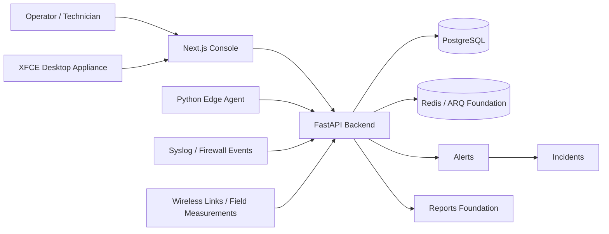
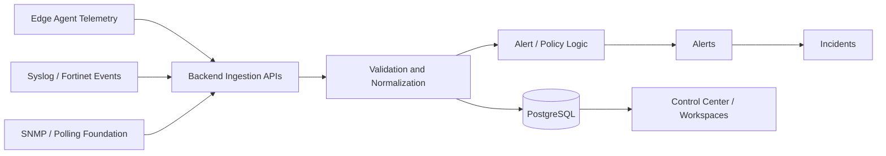
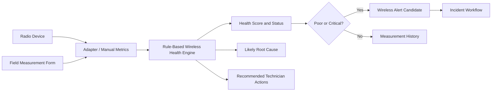
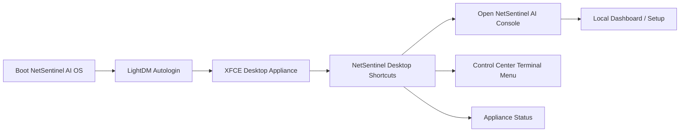
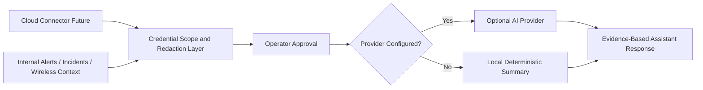

# NetSentinel AI Diagram Guide

This directory stores reviewed architecture and flow diagrams. Diagrams should
describe the real project structure or clearly marked roadmap architecture.

Do not include proprietary diagram assets. Do not include customer network diagrams,
customer topology diagrams, private addressing plans, or unreviewed vendor/cloud
claims.

## Platform Architecture

## Data Flow

## Wireless Diagnostics Flow

## Desktop Appliance Flow

## Future Cloud and AI Architecture

## Export Guidance

GitHub renders Mermaid diagrams in Markdown. For PDFs or presentation decks,
export reviewed Mermaid diagrams to SVG/PNG and store them here with matching
source Markdown.
