# 1. Executive Summary

NetSentinel AI is a local-first network management, observability, cybersecurity, and outdoor wireless radio diagnostics platform. It is designed to help organizations monitor infrastructure, manage assets, detect alerts and incidents, analyze logs, run discovery scans, maintain security rules and indicators of compromise, automate response playbooks, and diagnose outdoor wireless radio links using real RF measurement data.

The project currently operates as an MVP / work in progress. Its runtime model is local deployment with Docker Compose, supported by a FastAPI backend, Next.js frontend, PostgreSQL database, Redis queue/cache layer, ARQ background worker, Electron desktop shell, and a Python-based edge agent for telemetry and wireless metric collection.

NetSentinel AI exists because many organizations still operate networks through fragmented tools: one system for assets, another for logs, another for alerts, spreadsheets for incidents, separate vendor portals for wireless devices, and informal technician notes for RF diagnostics. This fragmentation slows response, hides root causes, and makes operational knowledge hard to preserve.

The platform is intended for network administrators, Wireless ISP teams, cybersecurity analysts, IT managers, field technicians, small enterprises, municipalities, and public institutions that need practical local infrastructure visibility without immediately adopting a complex cloud SIEM, enterprise NMS, or multiple disconnected vendor tools.

NetSentinel AI differs from normal monitoring tools by combining network operations, security monitoring, field workflows, AI-assisted explanation, and outdoor wireless diagnostics in a single operational environment. Outdoor wireless diagnostics are especially important because RF problems are frequently physical, environmental, intermittent, and difficult to interpret from raw numbers alone. Metrics such as RSSI, SNR, noise floor, CCQ, latency, packet loss, frequency, channel width, antenna alignment, and Fresnel zone clearance must be interpreted together.

> **MVP Limitation**  
> NetSentinel AI should not currently be described as production-ready. The codebase shows a runnable foundation, but additional validation, tests, security hardening, RBAC, audit logging, rate limiting, deployment hardening, and real integrations are required before enterprise production use.


# 2. Product Interface Preview

The following interface captures show the current MVP visual direction. They demonstrate the desktop-style operations experience and the field workflow surface for wireless measurements. These screens should be understood as MVP / work-in-progress views, not final production claims.

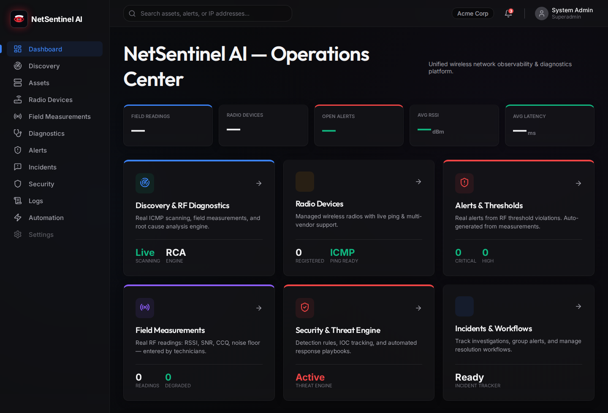{.interface-shot}

**Figure: Operations Center Dashboard.** This screen demonstrates the unified operations landing page, including navigation to discovery, assets, radio devices, field measurements, alerts, incidents, security, logs, and automation.

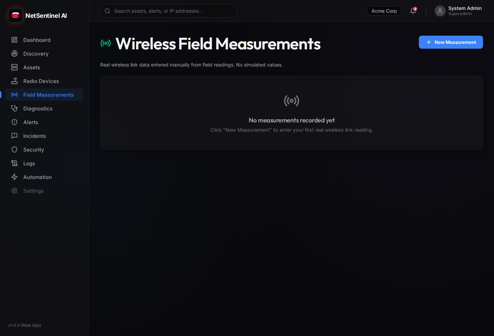{.interface-shot}

**Figure: Wireless Field Measurements.** This screen demonstrates the field data entry workflow for real wireless link readings such as RSSI, SNR, CCQ, noise floor, packet loss, and latency.


# 3. Project Vision

The long-term vision for NetSentinel AI is to become a local-first NOC/SOC platform for organizations that need operational control, network visibility, security awareness, and field-grade wireless diagnostics without surrendering all operational data to external cloud services.

The platform vision includes:

| Area | Vision |
|---|---|
| Local-first operations | Run core infrastructure monitoring locally, on-premise, or inside controlled private environments. |
| Network visibility | Maintain a unified inventory of organizations, sites, assets, wireless links, measurements, alerts, incidents, and logs. |
| Cybersecurity monitoring | Detect suspicious events using rules, IOCs, logs, and correlated alerts. |
| Wireless RF diagnostics | Translate raw RF measurements into technician-ready diagnostic insight. |
| AI-assisted troubleshooting | Explain incidents, summarize logs, propose likely causes, and recommend next steps based on internal evidence. |
| Automation | Use playbooks and response actions to standardize incident handling while preserving human approval. |
| Desktop-first experience | Provide a familiar local desktop launcher for operators who prefer an installed NOC/SOC workstation experience. |

> **Future Improvement**  
> The ideal mature version should support real-time updates, robust agent management, scheduled discovery, role-based dashboards, SIEM export, SNMP integrations, wireless vendor adapters, PDF reporting, and compliance workflows.

# 4. Problem Statement

Network and security teams often operate under pressure with incomplete or disconnected information. In many small and medium organizations, the operator must switch between router interfaces, wireless controller portals, spreadsheets, manual notes, log files, ticket systems, and messaging channels to understand a single incident.

Key problems include:

| Problem | Operational Impact |
|---|---|
| Fragmented tools | Slow troubleshooting and inconsistent incident records. |
| Disconnected assets, alerts, logs, and incidents | Root cause analysis becomes manual and error-prone. |
| Limited local NOC/SOC affordability | Smaller organizations cannot justify large enterprise platforms. |
| Difficult outdoor wireless diagnosis | RF problems require specialized knowledge and field context. |
| Weak historical context | Technician observations and measurements are not preserved in a structured way. |
| Limited automation | Teams repeat manual triage and response steps during recurring incidents. |
| Security blind spots | IOCs, rules, and logs may not be connected to operational assets and incidents. |

Outdoor wireless environments add a specialized layer of difficulty. A link can degrade because of interference, antenna misalignment, cable damage, water ingress, vegetation growth, tower movement, Fresnel zone obstruction, thermal effects, frequency reuse, or asymmetric endpoint conditions. Raw signal values alone rarely tell the full story.

# 5. Proposed Solution

NetSentinel AI proposes a unified local platform that connects network operations, cybersecurity visibility, wireless diagnostics, and automation into one operational workspace.

Core solution components include:

| Component | Contribution |
|---|---|
| Centralized dashboard | Provides a single operations view for assets, alerts, incidents, wireless links, logs, and security posture. |
| Asset inventory | Maintains structured records of network devices, servers, endpoints, and related sites. |
| Discovery scans | Performs network scan workflows and stores discovered host results. |
| Alerts and incidents | Converts operational or security findings into structured workflows. |
| Security rules and IOCs | Supports security detection concepts and future threat correlation. |
| Logs | Provides storage and review surfaces for event and system logs. |
| Automation playbooks | Supports future standardized response actions. |
| Edge telemetry agent | Collects telemetry and wireless metrics near the monitored environment. |
| Wireless measurement forms | Captures field measurements and RF diagnostics data. |
| AI assistant | Explains alerts, incidents, and wireless problems using internal evidence. |
| Docker deployment | Makes the MVP reproducible locally. |
| Desktop launcher | Gives operators a native desktop entry point into the local dashboard. |

# 6. Target Users

## Network Administrator

**Responsibilities:** Maintain uptime, manage infrastructure inventory, investigate connectivity problems, track device status, and coordinate changes.

**Needs:** Clear asset records, alerts, discovery scans, logs, topology context, and practical troubleshooting workflows.

## Wireless ISP Technician

**Responsibilities:** Install, align, maintain, and troubleshoot outdoor PTP/PTMP links and customer-premise radios.

**Needs:** RF metric history, field measurement capture, diagnostic scoring, likely-cause hints, maintenance logs, and technician action plans.

## Cybersecurity Analyst

**Responsibilities:** Review suspicious events, correlate alerts, maintain IOCs, investigate incidents, and recommend remediation.

**Needs:** Rules, IOCs, logs, incidents, evidence trails, risk scoring, and safe automation controls.

## IT Manager

**Responsibilities:** Oversee service quality, team performance, incident response, risk management, and reporting.

**Needs:** Executive dashboard, status summaries, incident reports, SLA indicators, and roadmap confidence.

## Field Technician

**Responsibilities:** Visit physical sites, inspect cabling, align antennas, replace equipment, and record measurements.

**Needs:** Mobile-friendly forms, pre-visit briefs, maintenance history, clear instructions, and offline-friendly workflows.

## Small Enterprise Owner

**Responsibilities:** Maintain business continuity with limited IT staff and limited budget.

**Needs:** Local deployment, simple dashboard, affordable monitoring, alerts, and practical reports.

## Municipality / Public Institution IT Team

**Responsibilities:** Maintain public networks, remote sites, surveillance links, civic infrastructure, and service continuity.

**Needs:** Local data control, auditability, operational visibility, wireless diagnostics, and future compliance reporting.

# 7. Core Platform Modules

## Dashboard / Operations Center

| Category | Description |
|---|---|
| Purpose | Provide a unified operational starting point for network, security, and wireless status. |
| Main features | Summary cards, navigation, recent alerts, incident visibility, asset context, dark operations UI. |
| Inputs | API data from assets, alerts, incidents, logs, security, wireless, discovery, and metrics. |
| Outputs | Operator awareness, navigation into investigation pages, high-level status indicators. |
| Current MVP state | Frontend dashboard structure exists. Data wiring varies by module. |
| Future improvements | Real-time updates, custom widgets, role-based views, SLA cards, topology map. |

## Discovery Engine

| Category | Description |
|---|---|
| Purpose | Identify reachable hosts on local network subnets. |
| Main features | CIDR scan request, ICMP ping sweep, scan results, host import concept. |
| Inputs | Subnet/CIDR, scan parameters, authenticated user context. |
| Outputs | Discovery scan records and discovered host records. |
| Current MVP state | Backend includes real ICMP ping-based subnet scanning service. |
| Future improvements | Scheduled scans, port detection, OS fingerprinting, SNMP discovery, agent-based scanning. |

## Asset Inventory

| Category | Description |
|---|---|
| Purpose | Maintain structured records for devices, servers, endpoints, and network assets. |
| Main features | List, create, update, delete, stats, site association. |
| Inputs | Asset metadata, site context, discovery imports. |
| Outputs | Asset records used by alerts, incidents, and dashboards. |
| Current MVP state | Backend models, schemas, routes, and frontend page exist. |
| Future improvements | Lifecycle tracking, ownership, warranty, firmware, credentials vault references, topology mapping. |

## Radio Devices

| Category | Description |
|---|---|
| Purpose | Track physical radio devices used in wireless networks. |
| Main features | Device inventory, vendor fields, adapter type, role, ping operations, diagnostic entry points. |
| Inputs | Radio metadata, IP addresses, vendor, role, field measurements. |
| Outputs | Radio device records and diagnostic reports. |
| Current MVP state | Backend router and frontend page exist. |
| Future improvements | Vendor APIs, SNMP profiles, MikroTik/Ubiquiti/TP-Link adapters, credential profiles. |

## Field Measurements

| Category | Description |
|---|---|
| Purpose | Capture technician observations and measured link conditions from the field. |
| Main features | Measurement records, status stats, update and delete operations. |
| Inputs | Signal values, latency, packet loss, capacity, notes, site/radio/link context. |
| Outputs | Structured field evidence for diagnostics and reports. |
| Current MVP state | Backend router and frontend page exist. |
| Future improvements | Mobile-first capture, photo attachments, GPS metadata, offline draft mode. |

## Wireless Diagnostics

| Category | Description |
|---|---|
| Purpose | Interpret RF metrics and field evidence for outdoor wireless links. |
| Main features | Wireless links, metrics, diagnostics, maintenance logs, AI field brief endpoint. |
| Inputs | RSSI, SNR, noise floor, CCQ, latency, packet loss, capacity, frequency, channel width, notes. |
| Outputs | Health score, likely cause, technician action plan, alert candidates. |
| Current MVP state | Wireless models, routes, pages, metrics, diagnostics, and field brief concepts exist. |
| Future improvements | Deterministic scoring engine, vendor-specific thresholds, trend detection, spectrum analysis. |

## Alerts & Thresholds

| Category | Description |
|---|---|
| Purpose | Surface conditions that require attention. |
| Main features | Alert CRUD, severity, status, stats, asset or wireless link association. |
| Inputs | Rules, thresholds, telemetry, security events, manual entries. |
| Outputs | Alerts linked to incidents and dashboards. |
| Current MVP state | Backend routes, schemas, models, and frontend page exist. |
| Future improvements | Rule builder, deduplication, suppression windows, notification channels. |

## Incidents & Workflows

| Category | Description |
|---|---|
| Purpose | Group related alerts into investigation and response workflows. |
| Main features | Incident list, stats, status changes, severity, CRUD. |
| Inputs | Alerts, manual incident creation, AI analysis, operator updates. |
| Outputs | Incident records, workflow state, investigation history. |
| Current MVP state | Backend routes and frontend page exist. |
| Future improvements | Timeline, assignment, comments, SLA, escalation, post-incident report. |

## Security & Threat Engine

| Category | Description |
|---|---|
| Purpose | Support security rules, IOCs, and future threat detection workflows. |
| Main features | Detection rules, IOCs, security page, threat engine service concepts. |
| Inputs | Logs, IOCs, rules, telemetry, asset context. |
| Outputs | Security alerts, incident candidates, risk indicators. |
| Current MVP state | Backend models/routes for rules and IOCs exist. |
| Future improvements | MITRE mapping, correlation engine, risk score, vulnerability integration. |

## Logs

| Category | Description |
|---|---|
| Purpose | Store and expose log events for observability and investigation. |
| Main features | Log ingestion/listing, filters, frontend log page. |
| Inputs | Application events, device logs, future syslog, agent telemetry. |
| Outputs | Searchable operational evidence and security signals. |
| Current MVP state | Backend log routes and frontend page exist. |
| Future improvements | Syslog collector, full-text search, retention policies, export. |

## Automation

| Category | Description |
|---|---|
| Purpose | Define response playbooks and track response actions. |
| Main features | List playbooks, list recent response actions. |
| Inputs | Alerts, incidents, operator approvals, playbook rules. |
| Outputs | Response action records and future remediation execution. |
| Current MVP state | Backend route is present; capabilities are early. |
| Future improvements | Action execution, approval workflow, rollback, integrations, audit log. |

## AI Assistant

| Category | Description |
|---|---|
| Purpose | Explain alerts, incidents, logs, and wireless degradation in operational language. |
| Main features | Chat endpoint, incident analysis, alert analysis, capabilities endpoint, wireless field brief concept. |
| Inputs | User prompt, incident/alert IDs, internal context, optional Gemini API key. |
| Outputs | Explanation, remediation suggestions, root cause hypotheses, confidence metadata. |
| Current MVP state | Backend AI endpoints exist with Gemini/fallback behavior. |
| Future improvements | Evidence citations, guarded tool use, prompt injection defenses, audit trail. |

## Edge Agent

| Category | Description |
|---|---|
| Purpose | Collect telemetry and wireless metrics near the monitored network. |
| Main features | SNMP client concept, wireless polling, backend transport, demo polling loop. |
| Inputs | Device IPs, community strings, vendor profile, backend URL, agent key. |
| Outputs | Normalized telemetry and wireless metrics sent to backend. |
| Current MVP state | Python agent entry point and polling structure exist. |
| Future improvements | Secure enrollment, offline queue, configuration sync, vendor adapters, health reporting. |

## Desktop Client

| Category | Description |
|---|---|
| Purpose | Provide a native desktop shell for local operators. |
| Main features | Electron window opening local dashboard, Linux launcher script, desktop entry. |
| Inputs | Local frontend URL and Docker Compose service status. |
| Outputs | Desktop application experience. |
| Current MVP state | Electron client and launcher exist. |
| Future improvements | Tray icon, auto-start, local health indicator, packaging for Linux and Windows. |

# 8. Technical Architecture

## High-Level Architecture

NetSentinel AI follows a modular local-first architecture. The MVP is deployed as a Docker Compose stack with a web dashboard, API backend, relational database, queue/cache layer, worker process, and edge telemetry agent.

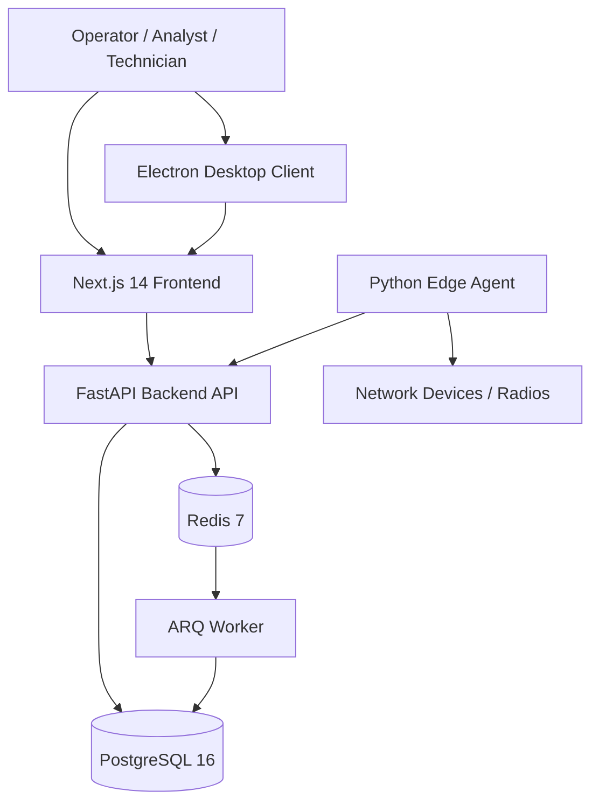

## Frontend Architecture

The frontend is a Next.js 14 application using TypeScript, React 18, CSS modules, SWR, Recharts, and lucide-react icons. It provides pages for the dashboard, assets, alerts, incidents, logs, security, automation, discovery, wireless, diagnostics, radio devices, and field measurements.

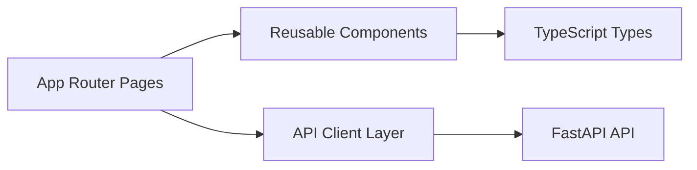

## Backend Architecture

The backend is a FastAPI application with routers, schemas, SQLAlchemy models, service modules, authentication dependencies, AI modules, ingestion endpoints, and worker integration.

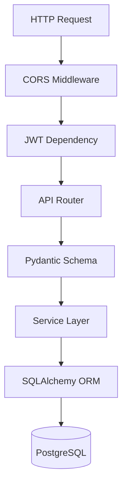

## Database Architecture

PostgreSQL stores core operational data: organizations, users, sites, assets, alerts, incidents, logs, security rules, IOCs, radio devices, wireless links, metrics, field measurements, diagnostics, automation playbooks, and response actions. SQLAlchemy models define the persistence layer and Alembic is present for migrations.

## Redis / Queue Architecture

Redis is used as a cache and queue foundation. The ARQ worker is wired through Redis and is intended to support future scheduled tasks, alert processing, telemetry processing, discovery jobs, notification jobs, and automation workflows.

## Edge Agent Architecture

The edge agent is a standalone Python process intended to run near customer networks. It includes SNMP polling concepts, wireless metric collection, and backend transport. The current implementation includes demo wireless targets and a polling loop.

## Desktop Client Architecture

The Electron desktop client wraps the local dashboard. The Linux launcher starts Docker Compose services, waits for frontend/backend readiness, and opens the local interface.

## Docker Compose Architecture

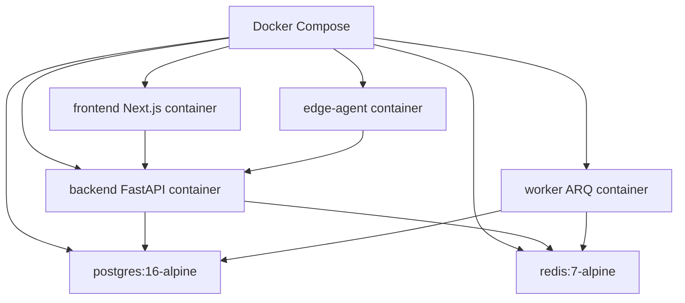

## API Communication Flow

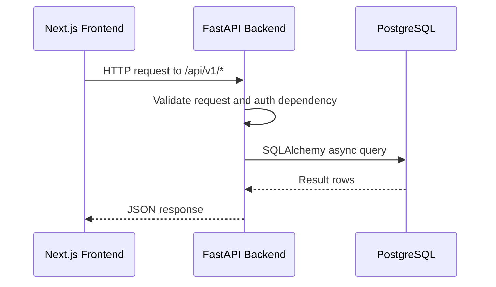

## Data Ingestion Flow

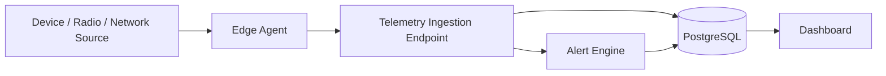

## Authentication Flow

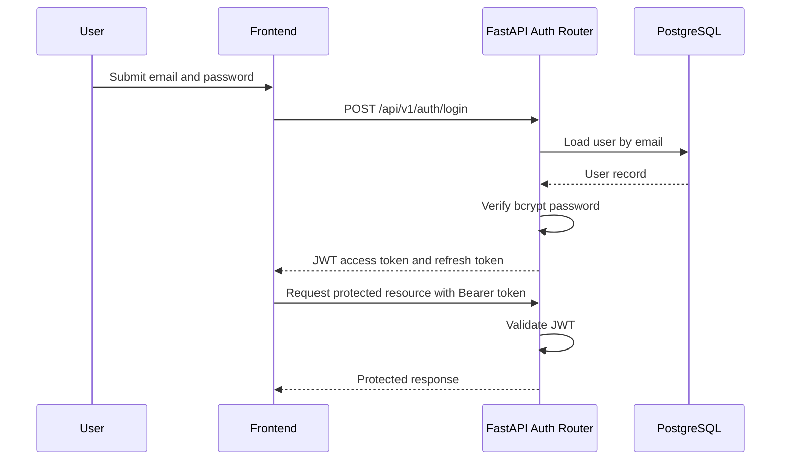

## Wireless Measurement Flow

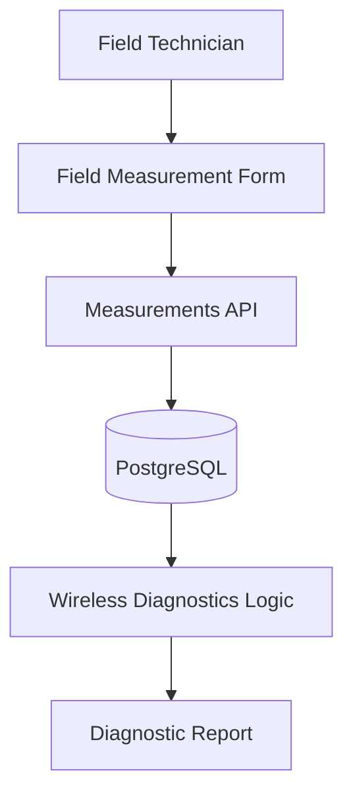

## Alert Generation Flow

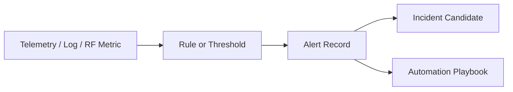

## AI Assistant Flow

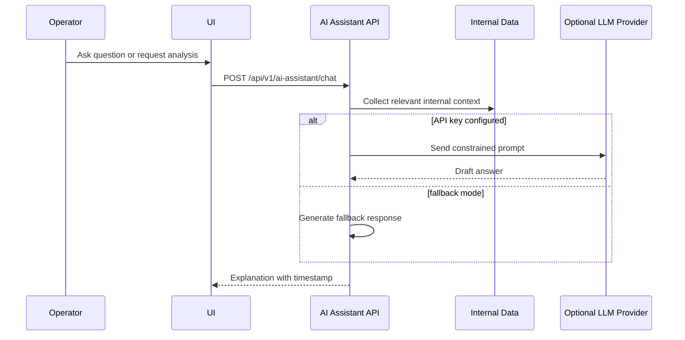

## Conceptual Entity Relationship Diagram

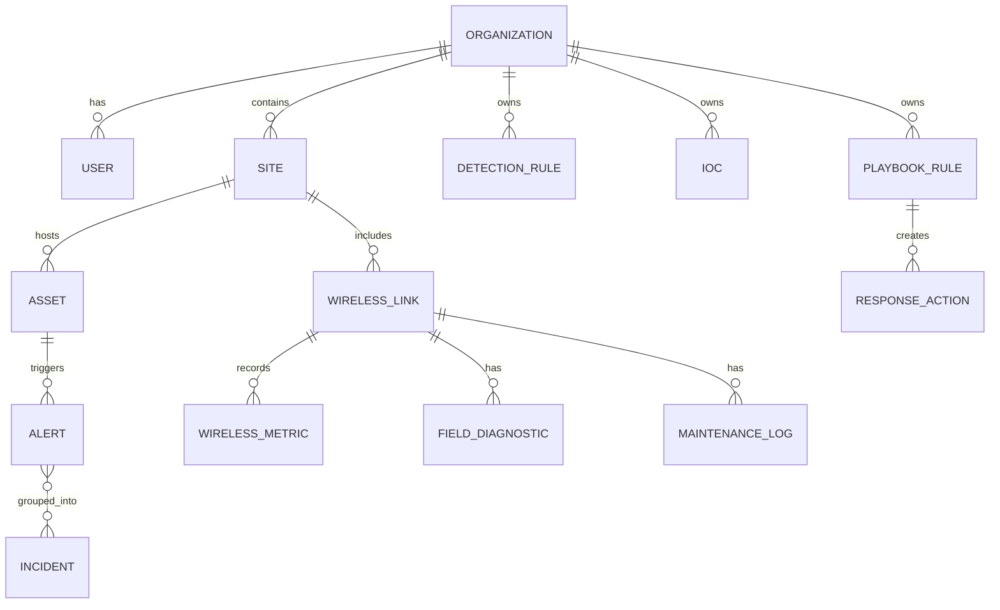

## Incident Workflow Diagram

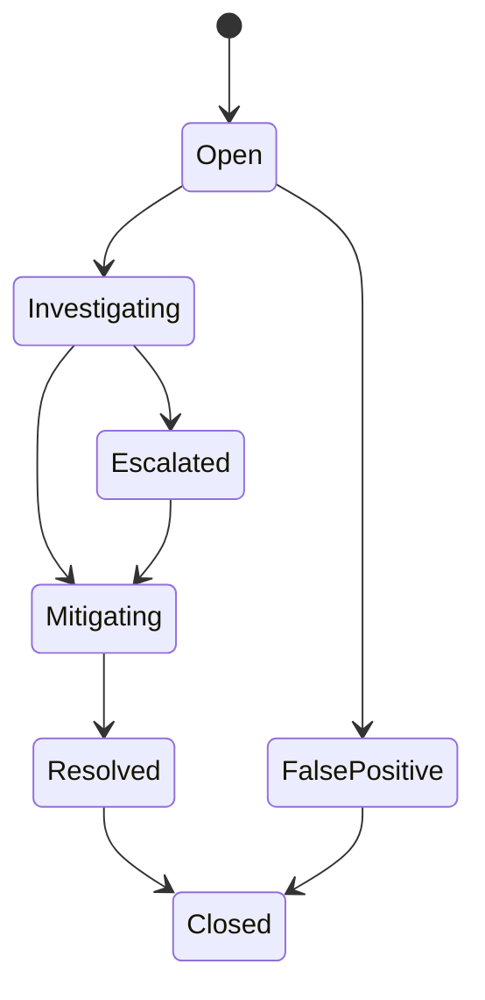

# 9. Backend Documentation

The FastAPI backend is the authoritative API layer for NetSentinel AI. It exposes `/api/v1/*` routers, manages application startup, initializes database tables during MVP runtime, configures CORS, and provides a `/health` endpoint.

## API Structure

| Area | Endpoint Group | Role |
|---|---|---|
| Authentication | `/api/v1/auth/*` | Register, login, refresh, current user. |
| Organizations | `/api/v1/organizations/*` | Multi-organization management. |
| Sites | `/api/v1/sites/*` | Physical/logical site records. |
| Assets | `/api/v1/assets/*` | Device and infrastructure inventory. |
| Alerts | `/api/v1/alerts/*` | Alert lifecycle and stats. |
| Incidents | `/api/v1/incidents/*` | Incident workflow and stats. |
| Logs | `/api/v1/logs/*` | Log creation and listing. |
| Security | `/api/v1/security/*` | Detection rules and IOCs. |
| Automation | `/api/v1/automation/*` | Playbooks and response actions. |
| Discovery | `/api/v1/discovery/*` | Scans and discovered hosts. |
| Wireless | `/api/v1/wireless/*` | Links, metrics, diagnostics, maintenance. |
| Field Measurements | `/api/v1/field-measurements/*` | Field measurement records. |
| Radio Devices | `/api/v1/radio-devices/*` | Radio inventory and diagnostics. |
| AI Assistant | `/api/v1/ai-assistant/*` | Chat, alert analysis, incident analysis. |
| Telemetry | `/api/v1/metrics` | Telemetry ingestion endpoint. |

## Authentication and JWT

The backend uses JWT access and refresh tokens. Password hashing uses bcrypt. The MVP settings define access token and refresh token lifetimes through environment variables.

> **Security Note**  
> The default development secret key must be changed before any shared or production-like deployment. JWT signing secrets should be generated with high entropy and stored outside source control.

## API Documentation Strategy

FastAPI automatically exposes interactive documentation:

| Documentation | URL |
|---|---|
| Swagger UI | `http://localhost:8000/docs` |
| ReDoc | `http://localhost:8000/redoc` |

Recommended additions:

| Recommendation | Rationale |
|---|---|
| Add endpoint descriptions and examples | Improves onboarding for engineers and external reviewers. |
| Add error response models | Makes API behavior predictable. |
| Add authentication examples | Helps frontend and integrators use JWT correctly. |
| Add versioning policy | Prevents future breaking changes from being ambiguous. |
| Export OpenAPI spec | Supports SDK generation and security review. |

## Error Handling Recommendations

| Area | Recommendation |
|---|---|
| Validation errors | Return structured field-level messages. |
| Authentication errors | Avoid leaking user existence or token internals. |
| Database errors | Log server-side details and return safe client messages. |
| Telemetry ingestion | Return accepted/rejected status with correlation IDs. |
| AI endpoints | Distinguish provider errors, fallback responses, and policy blocks. |

## Validation Recommendations

| Area | Recommendation |
|---|---|
| IDs | Validate UUIDs consistently. |
| CIDR input | Limit scan size and validate allowed ranges. |
| RF measurements | Validate numeric bounds for RSSI, SNR, noise floor, packet loss, latency. |
| Logs | Enforce max payload size and severity enums. |
| Automation | Validate action permissions and require approval for risky actions. |

## Backend Security Recommendations

| Risk | Recommendation |
|---|---|
| Weak JWT secret | Use a generated production secret and rotate safely. |
| Missing RBAC | Add roles, permissions, and organization isolation tests. |
| Exposed APIs | Add rate limiting, request size limits, and stricter CORS. |
| Telemetry abuse | Require agent identity, signed payloads, and replay protection. |
| AI misuse | Apply prompt injection controls and evidence-bound responses. |

# 10. Frontend Documentation

The frontend is a Next.js 14 application written in TypeScript. It is the primary operator interface for the platform and provides pages for dashboard operations, assets, alerts, incidents, logs, security, automation, discovery, wireless links, diagnostics, radio devices, and field measurements.

## UX Goals

| Goal | Description |
|---|---|
| Operational clarity | Present dense network/security data in a scannable way. |
| Low friction | Minimize clicks required for common investigation workflows. |
| Consistent navigation | Use stable sidebar navigation and predictable page layouts. |
| Professional trust | Maintain serious visual tone suitable for NOC/SOC environments. |
| Field usability | Support technicians recording wireless measurements quickly. |

## Frontend Elements

| Element | Expected Behavior |
|---|---|
| Dashboard UI | Summary cards, alerts, recent status, navigation into core modules. |
| Sidebar navigation | Persistent module access with clear labels. |
| Operational cards | Compact metrics, state counts, and urgent indicators. |
| Empty states | Explain absence of data without implying system failure. |
| Forms | Validate input, show clear errors, protect destructive actions. |
| Tables | Sortable/filterable lists for assets, logs, alerts, incidents, devices. |
| Wireless pages | Display RF metrics, diagnostics, maintenance history, and field actions. |
| Security pages | Expose rules, IOCs, risk states, and future detections. |
| Automation pages | Display playbooks, actions, and approval status. |

## Frontend Recommendations

| Area | Recommendation |
|---|---|
| Loading states | Add skeleton rows/cards for all API-backed pages. |
| Error states | Show actionable messages and retry controls. |
| Empty states | Provide contextual next actions, such as "Add asset" or "Run scan". |
| Form validation | Use shared schemas or generated API types where possible. |
| Responsive layout | Ensure field technician pages work on tablets and small laptops. |
| Accessibility | Maintain keyboard navigation, focus states, semantic headings, and contrast. |
| Design system | Standardize badges, severities, status colors, tables, forms, and modals. |

# 11. Database Documentation

PostgreSQL 16 is the primary data store. It stores operational entities, security entities, wireless diagnostics data, user and organization context, and automation records.

## Main Entities

| Entity | Purpose |
|---|---|
| Organization | Tenant or administrative owner of records. |
| User | Authenticated platform user. |
| Site | Physical or logical location. |
| Asset | Network device, server, endpoint, or managed infrastructure item. |
| Alert | Operational or security condition requiring attention. |
| Incident | Investigation workflow, usually grouping related alerts. |
| LogEntry | Event/log record for observability and security review. |
| DetectionRule | Security rule definition. |
| IndicatorOfCompromise | IOC record for threat detection. |
| RadioDevice | Physical wireless radio device. |
| WirelessLink | PTP/PTMP link record. |
| WirelessMetric | Time-based RF/quality measurement. |
| FieldMeasurement | Technician measurement record. |
| FieldDiagnostic | Diagnostic record tied to a wireless link. |
| MaintenanceLog | Maintenance history for wireless links. |
| PlaybookRule | Automation rule/playbook definition. |
| ResponseAction | Recorded automation action. |

## Conceptual ERD

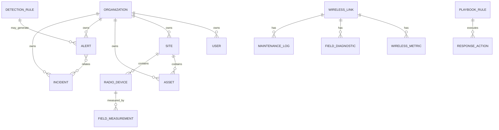

# 12. Edge Agent Documentation

The Python edge agent is intended to collect telemetry close to the monitored environment. It can poll devices, normalize measurements, and send data to the backend.

## Current Purpose

| Function | Description |
|---|---|
| Telemetry collection | Collect measurements from local devices and radios. |
| Wireless metrics | Poll RSSI, SNR, CCQ, and related RF indicators where vendor support exists. |
| Local discovery | Future role for agent-based scans inside protected networks. |
| Backend communication | Push normalized metrics to the NetSentinel API. |

## Agent Security Requirements

| Requirement | Recommendation |
|---|---|
| Agent identity | Assign each agent a unique ID and organization binding. |
| Agent authentication | Use signed tokens or mTLS rather than static development keys. |
| Payload integrity | Sign telemetry payloads and reject replayed timestamps. |
| Least privilege | Do not store broad device credentials in plain text. |
| Auditability | Log enrollment, configuration changes, and rejected payloads. |

## Retry and Offline Behavior

The mature agent should queue events locally when the backend is unavailable, retry with exponential backoff, preserve ordering where required, and report its own health. Offline queues should have retention limits, disk usage controls, and secure local storage.

# 13. Wireless Diagnostics

Outdoor wireless links require specialized diagnostic logic because link quality is affected by RF physics, antenna placement, weather, interference, channel planning, device configuration, and physical installation quality.

## Wireless Link Types

| Type | Description |
|---|---|
| Point-to-point | A dedicated link between two sites, commonly used for backhaul. |
| Point-to-multipoint | One access point communicates with multiple stations or CPEs. |

## RF and Quality Metrics

| Metric | Meaning |
|---|---|
| RSSI | Received Signal Strength Indicator, commonly expressed in dBm. Less negative is stronger. |
| SNR | Signal-to-noise ratio. Higher values usually indicate cleaner signal quality. |
| Noise floor | Background RF noise level. A high noise floor can reduce usable signal quality. |
| CCQ | Client Connection Quality or link quality indicator, often reflecting retransmissions and stability. |
| Latency | Round-trip delay. High latency may indicate congestion, retransmissions, or poor RF quality. |
| Packet loss | Percentage of packets lost. Loss directly affects voice, video, and data reliability. |
| TX/RX capacity | Estimated transmit and receive throughput capacity. |
| Frequency | Operating frequency/channel. Poor frequency planning can cause interference. |
| Channel width | RF channel width. Wider channels can improve throughput but increase noise exposure. |
| Antenna alignment | Physical aiming quality between endpoints. Misalignment reduces RSSI and SNR. |
| Fresnel zone | Elliptical path around line-of-sight that should remain clear for strong propagation. |
| Interference | Competing RF energy that reduces signal quality and stability. |
| Modulation | Encoding scheme used by radio link. Lower modulation often means degraded link quality. |
| Link degradation | Decline in performance caused by RF, physical, configuration, or environmental problems. |

## Diagnostic Logic Table

| Condition | Possible Cause | Severity | Recommended Technician Action |
|---|---|---|---|
| Weak RSSI | Antenna misalignment, obstruction, cable loss, wrong antenna gain, water ingress. | Medium to Critical | Inspect line of sight, verify Fresnel zone, check mounts, perform alignment sweep, inspect connectors. |
| Low SNR | Interference, high noise floor, weak signal, poor channel selection. | High | Run spectrum scan, change frequency, reduce channel width, improve alignment, verify shielding. |
| High noise floor | Congested spectrum, nearby transmitters, poor frequency reuse. | High | Scan spectrum at both ends, select cleaner channel, adjust channel width, coordinate frequency plan. |
| Low CCQ | Retransmissions, interference, firmware issue, poor modulation stability. | Medium to High | Check RF quality, review firmware, inspect error counters, test alternate channel. |
| High packet loss | RF instability, congestion, duplex mismatch, queue saturation, failing radio. | High | Run ping and throughput tests, check CPU/load, inspect RF metrics, isolate traffic congestion. |
| High latency | Congestion, retransmissions, overloaded radio, poor signal quality. | Medium to High | Review traffic load, queue settings, RF quality, and endpoint health. |
| Low capacity | Poor modulation, narrow channel, weak SNR, distance limits. | Medium | Review modulation rate, channel width, antenna gain, frequency, and regulatory limits. |
| Asymmetric throughput | One endpoint interference, TX power mismatch, antenna/cable issue on one side. | Medium | Test both directions, inspect each endpoint separately, compare local noise floor and RSSI. |
| Intermittent link | Loose mount, power issue, weather exposure, fading, cable fault, interference pattern. | Critical if service-affecting | Check power, grounding, cable ingress, mounting stability, and time-correlated RF trends. |

## Wireless Link Health Score Model

The proposed health score ranges from 0 to 100. It should be deterministic, explainable, and based on weighted RF and performance indicators.

| Score Range | Meaning | Operational Interpretation |
|---|---|---|
| 90-100 | Excellent | Link is healthy with strong margin. |
| 75-89 | Good | Link is usable with minor monitoring recommendations. |
| 60-74 | Degraded | Link needs review; performance risk is present. |
| 40-59 | Poor | Field intervention likely required. |
| 0-39 | Critical | Service-impacting failure or imminent failure likely. |

Suggested scoring weights:

| Metric | Weight |
|---|---:|
| RSSI versus expected baseline | 20 |
| SNR | 20 |
| Noise floor | 15 |
| CCQ / retransmission quality | 15 |
| Packet loss | 15 |
| Latency | 10 |
| Capacity symmetry | 5 |

> **Important**  
> RF thresholds must be vendor-aware and band-aware. A universal threshold can be useful for MVP triage, but production diagnostics should account for radio model, frequency band, link distance, antenna gain, modulation, channel width, and environmental profile.

# 14. Cybersecurity

NetSentinel AI aims to provide local-first security monitoring by connecting logs, security rules, indicators of compromise, alerts, incidents, and automation workflows.

## Security Monitoring Goals

| Goal | Description |
|---|---|
| Detect suspicious activity | Use rules, IOCs, logs, and telemetry to identify abnormal events. |
| Preserve local control | Keep sensitive operational data inside the local deployment by default. |
| Connect security to operations | Link security events to assets, incidents, and response workflows. |
| Support analyst review | Provide evidence, timeline, severity, and remediation context. |

## Risks and Mitigations

| Risk | Impact | Mitigation |
|---|---|---|
| JWT risks | Token theft can enable account compromise. | Short-lived access tokens, refresh rotation, secure storage, revocation strategy. |
| Weak secrets | Attackers can forge tokens or access services. | Strong generated secrets, secret rotation, external secret store. |
| Exposed Docker ports | Local services may be reachable by unintended networks. | Bind to localhost where possible, firewall, reverse proxy, TLS. |
| Telemetry ingestion abuse | Attackers can flood or poison metrics. | Agent authentication, signed payloads, rate limits, schema validation. |
| AI prompt injection | Malicious logs or prompts may influence AI output. | Prompt isolation, evidence filtering, policy guardrails, source citations. |
| Data leakage | Sensitive logs or topology data may be exposed. | RBAC, audit logs, encryption, redaction, least privilege. |
| Missing rate limiting | APIs can be abused or overloaded. | Add per-user and per-agent rate limits. |
| Missing RBAC | Users may access data outside their role. | Implement roles, permissions, and organization isolation tests. |
| Missing tests | Regressions can compromise reliability. | Add unit, integration, API, security, and E2E tests. |
| Missing audit logs | Security actions lack traceability. | Record authentication, configuration, automation, and privileged actions. |

> **Security Note**  
> Local-first does not automatically mean secure. It reduces cloud exposure, but the local deployment still requires secrets management, least privilege, secure configuration, and regular updates.

# 15. Deployment Documentation

## Local Deployment

The MVP runtime is Docker Compose. The stack includes PostgreSQL, Redis, backend, frontend, worker, and edge-agent services.

## Commands

```bash
cp .env.example .env
`docker compose up --build -d`
docker compose exec backend python -m app.seed
./Launch_NetSentinel.sh
```

## Local Services

| Service | URL / Port | Purpose |
|---|---|---|
| Dashboard | `http://localhost:3000` | Next.js dashboard UI. |
| Backend API | `http://localhost:8000` | FastAPI backend. |
| Swagger Docs | `http://localhost:8000/docs` | Interactive API documentation. |
| PostgreSQL | `localhost:5432` | Primary database. |
| Redis | `localhost:6379` | Cache and queue backend. |

## Docker Services

| Compose Service | Image / Build | Purpose |
|---|---|---|
| postgres | `postgres:16-alpine` | Main relational database. |
| redis | `redis:7-alpine` | Cache and queue. |
| backend | `./backend` | FastAPI application. |
| frontend | `./frontend` | Next.js application. |
| worker | `./backend` | ARQ background worker. |
| edge-agent | `./edge-agent` | Telemetry and wireless polling agent. |

## Startup Checklist

| Check | Expected Result |
|---|---|
| `.env` exists | Environment variables loaded. |
| Docker is running | Compose can start containers. |
| Ports free | 3000, 8000, 5432, and 6379 are available. |
| Database healthy | PostgreSQL healthcheck passes. |
| Redis healthy | Redis responds to ping. |
| Backend healthy | `/health` returns healthy status. |
| Frontend reachable | Dashboard loads at port 3000. |
| Seed data optional | Demo data available after seed command. |

## Troubleshooting Checklist

| Symptom | Suggested Action |
|---|---|
| Port already in use | Stop conflicting service or change Compose ports. |
| Docker permission denied | Use Docker group configuration or authorized `pkexec` workflow. |
| Backend cannot connect to DB | Check `DATABASE_URL`, service name, and PostgreSQL health. |
| Frontend cannot call API | Check `NEXT_PUBLIC_API_URL` and CORS origins. |
| Desktop window opens early | Wait for Docker build and service readiness. |
| AI returns fallback | Configure `GEMINI_API_KEY` if live provider behavior is required. |

## Backup Recommendations

| Asset | Recommendation |
|---|---|
| PostgreSQL data | Schedule `pg_dump` backups and test restores. |
| Environment secrets | Store outside Git and back up securely. |
| Uploaded reports | Store in versioned object/file storage if uploads are added. |
| Configuration | Export rules, IOCs, playbooks, and agent configs. |

## Production Hardening Recommendations

| Area | Recommendation |
|---|---|
| Network exposure | Do not expose database or Redis publicly. |
| TLS | Terminate HTTPS through a reverse proxy. |
| Secrets | Use a secret manager or secure environment injection. |
| Authentication | Add RBAC, audit logs, token revocation, and secure cookie strategy. |
| Containers | Run non-root, pin images, scan dependencies, set resource limits. |
| Database | Use backups, migration discipline, least-privilege DB users. |

# 16. Desktop Client

Electron is used to provide a local desktop experience for operators. Instead of requiring operators to remember URLs or manually open a browser, the desktop shell launches the local dashboard in a native window.

## Advantages

| Advantage | Description |
|---|---|
| Familiar application model | Operators can open NetSentinel AI from the Linux application menu. |
| Local workstation feel | Supports NOC/SOC workstation workflows. |
| Controlled entry point | Launcher can start services and open the dashboard. |
| Future system integration | Can support tray status, notifications, and local service health. |

## Future Improvements

| Feature | Value |
|---|---|
| Tray icon | Quick status and launch controls. |
| Auto-start | Start monitoring environment after login. |
| Local status indicator | Show backend/frontend/database readiness. |
| Update system | Support packaged updates. |
| Offline mode | Show cached status when services are unavailable. |
| Packaged installers | Linux and Windows deployment packages. |

# 17. AI Assistant

The AI assistant is intended to help operators understand incidents, alerts, wireless diagnostics, logs, and remediation options. It should act as an explanation and decision-support layer, not an autonomous authority.

## Use Cases

| Use Case | Description |
|---|---|
| Incident explanation | Summarize what happened and why it matters. |
| Wireless diagnostics | Explain RF degradation and suggest field actions. |
| Log summarization | Identify patterns and important events in logs. |
| Root cause analysis | Generate hypotheses based on internal evidence. |
| Suggested remediation | Propose next steps while requiring human approval. |

## AI Risks

| Risk | Description |
|---|---|
| Hallucination | AI may invent causes or remediation steps. |
| Prompt injection | Malicious logs or user prompts may manipulate output. |
| Sensitive data exposure | Internal logs and topology may contain confidential information. |
| Overtrust | Operators may follow AI recommendations without verification. |

## Mitigations

| Mitigation | Description |
|---|---|
| Evidence-based answers | Tie output to internal records and observed metrics. |
| Source citations | Reference incident IDs, alert IDs, logs, and metrics used. |
| Confidence levels | Expose uncertainty and alternative explanations. |
| Human approval | Require approval before automation or remediation actions. |
| Redaction | Remove secrets and sensitive fields before model calls. |

# 18. Automation

Automation should standardize recurring operational and security responses without removing operator control.

## Automation Concepts

| Concept | Description |
|---|---|
| Playbook | Rule or workflow describing when and how to respond. |
| Action | Recorded or executed response step. |
| Human approval | Approval gate before risky changes. |
| Incident response | Standard process for triage, containment, remediation, and closure. |
| Alert handling | Deduplication, escalation, assignment, and notification. |

## Future Automated Remediation

Potential actions include creating tickets, sending notifications, quarantining an asset, blocking an IP, restarting a service, scheduling a field visit, or generating a PDF incident report. High-risk actions must be approval-based and fully audited.

# 19. Current MVP Status

| Area | Status | Notes |
|---|---|---|
| Docker Compose local runtime | Implemented | Compose defines PostgreSQL, Redis, backend, frontend, worker, and edge-agent. |
| FastAPI backend | Implemented | Main app and routers exist. |
| Next.js frontend | Implemented | Multiple operational pages exist. |
| PostgreSQL models | Implemented | Core models are present. |
| JWT authentication | Implemented | Register, login, refresh, and current user routes exist. |
| Asset inventory | Implemented | Backend routes and frontend page exist. |
| Alerts and incidents | Implemented | CRUD and stats endpoints exist. |
| Logs | Partially implemented | Log creation/listing exists; advanced ingestion/search planned. |
| Security rules and IOCs | Partially implemented | Basic routes exist; correlation and detection need expansion. |
| Automation | Early MVP | Playbooks/actions listing exists; execution workflow needs expansion. |
| Discovery | Partially implemented | Real ICMP scan service exists; broader discovery planned. |
| Wireless diagnostics | Partially implemented | Wireless entities and AI brief concepts exist; deterministic scoring needs completion. |
| Edge agent | Early MVP | Polling structure exists with demo targets. |
| Desktop launcher | Implemented | Electron shell and Linux launcher exist. |
| Tests | Missing / needs verification | No clear project test suite found in backend or frontend source. |
| Security hardening | Planned | RBAC, rate limiting, audit logs, and hardened deployment are needed. |
| Production readiness | Not ready | MVP foundation only. |

# 20. Roadmap

## v0.1 MVP Stabilization

| Area | Goals |
|---|---|
| Features | Stabilize existing dashboard, APIs, seed data, desktop launcher, and Docker runtime. |
| Technical tasks | Add migrations discipline, API response consistency, shared frontend types, error handling. |
| Security tasks | Replace dev secrets, document local-only assumptions, validate auth flows. |
| Documentation tasks | Maintain README, install guide, API overview, and this foundation dossier. |

## v0.2 Real Data & Diagnostics

| Area | Goals |
|---|---|
| Features | Expand discovery, real wireless metric ingestion, diagnostic reports, field workflows. |
| Technical tasks | Add deterministic wireless health score and trend analysis. |
| Security tasks | Authenticate telemetry agents and validate payloads. |
| Documentation tasks | Add wireless diagnostics guide and field technician runbooks. |

## v0.3 Security Hardening

| Area | Goals |
|---|---|
| Features | Security dashboard improvements, rules, IOCs, incident correlation. |
| Technical tasks | Add rate limiting, audit logs, RBAC, organization isolation tests. |
| Security tasks | Dependency scanning, threat model, secure deployment profile. |
| Documentation tasks | Security operations guide and hardening guide. |

## v0.4 Edge Agent Expansion

| Area | Goals |
|---|---|
| Features | Agent enrollment, SNMP profiles, vendor adapters, offline queue. |
| Technical tasks | Agent configuration sync, retry logic, health reporting. |
| Security tasks | Signed payloads, agent tokens, replay protection. |
| Documentation tasks | Agent installation and troubleshooting manual. |

## v0.5 Automation & AI Copilot

| Area | Goals |
|---|---|
| Features | AI evidence citations, automation approval workflows, remediation suggestions. |
| Technical tasks | Playbook execution engine, AI context retrieval, confidence scoring. |
| Security tasks | Prompt injection controls and automation audit trail. |
| Documentation tasks | AI usage policy and automation playbook guide. |

## v1.0 Production-Ready Release

| Area | Goals |
|---|---|
| Features | Role-based dashboards, reports, notifications, backup/restore, compliance views. |
| Technical tasks | E2E testing, observability, performance testing, installer packages. |
| Security tasks | RBAC, SSO/OIDC option, hardened Docker/Kubernetes profile. |
| Documentation tasks | Admin guide, operator guide, API reference, deployment guide, security guide. |

# 21. Testing Strategy

| Test Type | Scope |
|---|---|
| Backend unit tests | Services, auth utilities, validation logic, diagnostic scoring. |
| Backend integration tests | Database operations, router behavior, auth-protected endpoints. |
| API tests | OpenAPI contract, expected errors, pagination, filtering, status codes. |
| Frontend component tests | Tables, forms, badges, cards, navigation, error states. |
| End-to-end tests | Login, asset creation, discovery scan, alert workflow, wireless measurement. |
| Security tests | JWT validation, organization isolation, rate limits, CORS, input abuse. |
| Docker startup tests | Compose startup, health checks, seed command, service connectivity. |
| Wireless diagnostic rule tests | Known metric inputs produce expected severity and technician actions. |
| Agent tests | Polling errors, retry behavior, backend transport, offline queue. |
| Regression tests | Protect previously fixed workflows from breaking. |

> **MVP Limitation**  
> A formal test suite was not clearly present in the checked source tree. Adding tests should be treated as a near-term engineering priority.

# 22. Security Hardening Checklist

| Item | Status |
|---|---|
| Strong JWT secret configured outside Git | Required |
| Access and refresh token expiration reviewed | Required |
| RBAC implemented | Required before production |
| Organization isolation enforced and tested | Required before production |
| Input validation for all endpoints | Required |
| API rate limiting | Required |
| CORS restricted to trusted origins | Required |
| Docker ports not publicly exposed | Required |
| Secrets management process | Required |
| Audit logs for auth/config/automation | Required |
| Password hashing with secure parameters | Present concept; verify settings |
| Database backup and restore tested | Required |
| Dependency scanning | Required |
| API abuse protection | Required |
| Telemetry agent authentication | Required |
| AI endpoint protection and prompt injection mitigation | Required |
| Security headers through reverse proxy | Recommended |
| TLS termination | Required beyond local-only use |
| Log redaction | Recommended |
| Incident export controls | Recommended |

# 23. Business and Product Positioning

NetSentinel AI targets the gap between lightweight device monitoring tools and large enterprise NMS/SIEM platforms. Many organizations need practical local visibility, incident workflows, wireless diagnostics, and security monitoring but cannot justify large enterprise systems or do not want full cloud dependence.

## Market Need

| Need | Explanation |
|---|---|
| Local infrastructure visibility | Organizations need to understand assets, alerts, incidents, and logs. |
| Wireless diagnostics | WISPs and public institutions often depend on outdoor radio links. |
| Affordable NOC/SOC tooling | Small and medium teams need structured workflows without enterprise overhead. |
| Data control | Local-first deployment can support privacy and operational control. |

## Differentiation

| Differentiator | Value |
|---|---|
| Local-first architecture | Keeps operational data close to the organization. |
| Wireless RF focus | Goes beyond standard uptime monitoring. |
| Combined NOC/SOC model | Connects operations and security workflows. |
| Desktop launcher | Supports operator workstation usage. |
| AI-assisted explanation | Helps translate complex evidence into practical actions. |

## Enterprise Potential

Future commercial positioning could include community edition, professional support, enterprise licensing, managed appliances, SIEM integrations, vendor adapters, compliance reporting, and role-based operational dashboards.

# 24. Future Enterprise Features

| Feature | Description |
|---|---|
| Multi-tenant RBAC | Fine-grained roles and permissions across organizations. |
| SNMP integrations | Standard polling for network infrastructure. |
| MikroTik integration | RouterOS and wireless device support. |
| Ubiquiti integration | UISP/airMAX/UniFi-oriented device support where feasible. |
| TP-Link CPE integration | Support for common wireless CPE deployments. |
| Syslog ingestion | UDP/TCP syslog collection and parsing. |
| NetFlow/sFlow | Network traffic flow visibility. |
| SIEM export | Export alerts/events to external SIEM tools. |
| PDF reports | Incident, wireless diagnostic, and executive reports. |
| Role-based dashboards | Different views for executives, analysts, admins, and technicians. |
| Notification channels | Email, Slack, Teams, webhooks, SMS. |
| SLA tracking | Availability and incident response metrics. |
| Compliance reports | SOC 2, ISO 27001, local policy reporting support. |
| Backup and restore | Admin-controlled backup lifecycle. |
| Offline edge collectors | Resilient local agents for remote sites. |

# 25. Official Appendices

## Appendix A: Glossary

| Term | Meaning |
|---|---|
| NOC | Network Operations Center. |
| SOC | Security Operations Center. |
| RF | Radio Frequency. |
| RSSI | Received Signal Strength Indicator. |
| SNR | Signal-to-noise ratio. |
| CCQ | Connection quality indicator often used in wireless systems. |
| IOC | Indicator of Compromise. |
| JWT | JSON Web Token. |
| PTP | Point-to-point wireless link. |
| PTMP | Point-to-multipoint wireless network. |
| Fresnel zone | Area around wireless line-of-sight that should remain unobstructed. |
| ARQ | Async Redis Queue for Python background jobs. |

## Appendix B: API Reference Summary

| Module | Summary |
|---|---|
| Auth | Register, login, refresh token, current user. |
| Organizations | CRUD for organization records. |
| Sites | CRUD for site records. |
| Assets | CRUD and stats for assets. |
| Alerts | CRUD and stats for alerts. |
| Incidents | CRUD and stats for incidents. |
| Logs | Create and list log entries. |
| Security | Manage detection rules and IOCs. |
| Automation | List playbooks and response actions. |
| Discovery | Run scans, list scans, list hosts, import hosts as assets. |
| Wireless | Manage antenna profiles, mounts, interfaces, links, metrics, diagnostics, maintenance. |
| Field Measurements | Manage field measurements and stats. |
| Radio Devices | Manage radio devices and diagnostics. |
| AI Assistant | Chat, incident analysis, alert analysis, capabilities. |
| Telemetry | Accept telemetry metrics. |

## Appendix C: Environment Variables

| Variable | Purpose | Example |
|---|---|---|
| `POSTGRES_USER` | Database user | `netsentinel` |
| `POSTGRES_PASSWORD` | Database password | `netsentinel_dev_password` |
| `POSTGRES_DB` | Database name | `netsentinel` |
| `DATABASE_URL` | Backend database connection | `postgresql+asyncpg://...` |
| `REDIS_URL` | Redis connection | `redis://redis:6379/0` |
| `SECRET_KEY` | JWT signing secret | Replace in non-local use |
| `JWT_ALGORITHM` | JWT algorithm | `HS256` |
| `ACCESS_TOKEN_EXPIRE_MINUTES` | Access token lifetime | `30` |
| `REFRESH_TOKEN_EXPIRE_DAYS` | Refresh token lifetime | `7` |
| `NEXT_PUBLIC_API_URL` | Frontend API base URL | `http://localhost:8000/api/v1` |
| `ENVIRONMENT` | Runtime mode | `development` |
| `DEBUG` | Debug mode | `true` |
| `GEMINI_API_KEY` | Optional AI provider key | Empty by default |

## Appendix D: Docker Services Table

| Service | Container Name | Port |
|---|---|---|
| PostgreSQL | `netsentinel-postgres` | `5432` |
| Redis | `netsentinel-redis` | `6379` |
| Backend | `netsentinel-backend` | `8000` |
| Frontend | `netsentinel-frontend` | `3000` |
| Worker | `netsentinel-worker` | Internal |
| Edge Agent | `netsentinel-edge-agent` | Internal |

## Appendix E: Example Wireless Measurement

| Field | Example |
|---|---|
| Link name | North Tower to City Hall |
| Type | Point-to-point |
| Frequency | 5.8 GHz |
| Channel width | 40 MHz |
| RSSI | -68 dBm |
| SNR | 27 dB |
| Noise floor | -95 dBm |
| CCQ | 92% |
| Latency | 4 ms |
| Packet loss | 0.2% |
| TX capacity | 180 Mbps |
| RX capacity | 165 Mbps |
| Technician notes | Alignment acceptable; monitor during peak traffic. |

## Appendix F: Example Diagnostic Report

| Section | Example |
|---|---|
| Summary | Link is degraded but service remains usable. |
| Evidence | RSSI is 8 dB worse than expected baseline; CCQ dropped below 85%. |
| Likely cause | Minor antenna movement or partial Fresnel obstruction. |
| Severity | Medium |
| Recommended action | Inspect mounting stability, verify line of sight, run spectrum scan. |

## Appendix G: Example Incident Workflow

| Step | Action |
|---|---|
| 1 | Alert generated for degraded wireless link. |
| 2 | Incident opened and assigned to network technician. |
| 3 | AI assistant summarizes likely RF cause. |
| 4 | Field technician records measurements. |
| 5 | Technician realigns antenna and records maintenance log. |
| 6 | Alert resolves and incident is closed with notes. |

## Appendix H: Example Security Rule

| Field | Example |
|---|---|
| Name | Repeated failed login attempts |
| Condition | More than 10 failed logins from same source in 5 minutes |
| Severity | High |
| Action | Create alert and recommend investigation |
| Future automation | Temporarily block source IP after approval |

## Appendix I: Example Automation Playbook

| Field | Example |
|---|---|
| Name | Wireless degradation response |
| Trigger | Wireless health score below 60 |
| Conditions | Packet loss above 3% or SNR below 18 dB |
| Actions | Create incident, notify technician, generate field brief |
| Approval | Required before service-impacting action |

## Appendix J: Recommended Folder Structure

```text
NetSentinel AI/
  backend/
    app/
      models/
      schemas/
      routers/
      services/
      security/
      ai/
      ingestion/
      worker/
    alembic/
  frontend/
    src/
      app/
      components/
      lib/
  edge-agent/
  desktop-client/
  docker/
  docs/
  shared/
```

## Appendix K: Recommended Documentation Structure

| Document | Purpose |
|---|---|
| `README.md` | Project overview and quick start. |
| `INSTALL.md` | Local and desktop installation guide. |
| `architecture.md` | System architecture and design rationale. |
| `SECURITY.md` | Security policy and deployment warnings. |
| `roadmap.md` | Product roadmap and planned phases. |
| `docs/API.md` | API reference summary and examples. |
| `docs/OPERATOR_GUIDE.md` | Network/security operator workflows. |
| `docs/WIRELESS_DIAGNOSTICS.md` | RF measurement and diagnosis guide. |
| `docs/DEPLOYMENT_HARDENING.md` | Production hardening recommendations. |

